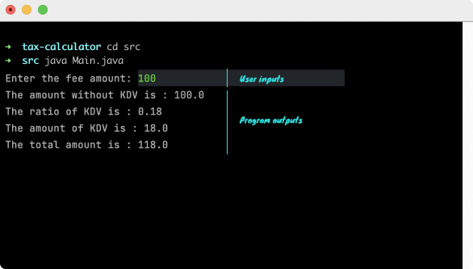

# Tax Calculator
## You can calculate tax aka KDV in Turkey via Tax Calculator easily.
>KDV, which stands for "Katma değer vergesi," in English called VAT. Everything you buy in Turkey has a KDV, which the seller receives from the buyer and pays to the government.
### On terminal:

### Requirements:
* JDK (version 17 is recommended)

### To run:
Open terminal on project directory and type:

```
$ cd src
$ java Main.java
```
## Author

👤 **Furkan Denizhan**

- GitHub: [nevisende](https://github.com/nevisende)
- Twitter: [@nevisen_de](https://twitter.com/nevisen_de)
- LinkedIn: [furkan-denizhan](https://www.linkedin.com/in/furkan-denizhan/)

## 🤝 Contributing

Contributions, issues, and feature requests are welcome!

Feel free to check the [issues page](../../issues/).

## Show your support

Give a ⭐️ if you like this project!

## Acknowledgments

- This repo is created for  www.patika.dev and ebebek Java & QA & SAP Spartacus Practicum.
